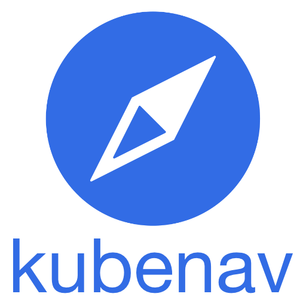
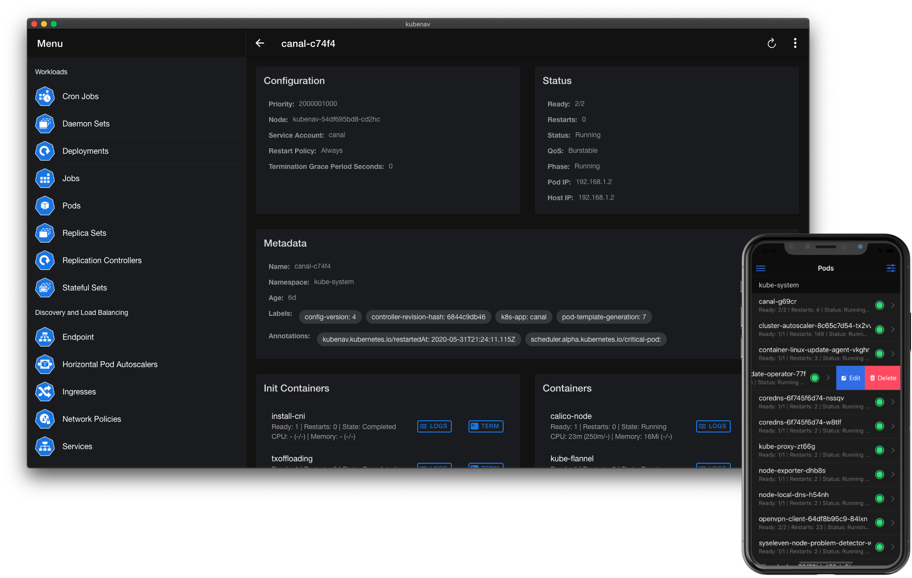

<div align="center">
  
  <br><br>

  **kubenav** is the navigator for your **Kubernetes** clusters right in your pocket. kubenav is a **mobile, desktop and web** app to manage Kubernetes clusters and to get an overview of the status of your resources.

  <p>
    <a href="https://apps.apple.com/us/app/kubenav/id1494512160" target="_blank"></a>
    <a href="https://play.google.com/store/apps/details?id=io.kubenav.kubenav" target="_blank"></a>
    <a href="https://github.com/kubenav/kubenav/releases" target="_self"></a>
  </p>

  
</div>

kubenav is a mobile, desktop and web app to manage Kubernetes clusters. The app provides an overview of all resources in a Kubernetes cluster, including current status information for workloads. The details view for resources provides additional information. It is possible to view logs and events or to get a shell into a container. You can also edit and delete resources or scale your workloads within the app.

The app is developed using [Ionic Framework](https://ionicframework.com) and [Capacitor](https://capacitor.ionicframework.com). The frontend part of the app is implemented using TypeScript and React functional components. The backend part uses [Go mobile](https://github.com/golang/go/wiki/Mobile) for communication with the Kubernetes API server and Cloud Providers. So it is possible to achieve nearly 100% code sharing between the mobile and desktop implementation of kubenav.

## Features

- **Available for mobile, desktop and web:** kubenav provides the same experience for mobile, desktop and web, with nearly 100% code sharing.
- **Manage Resources:** All major resources like Deployments, StatefulSets, DaemonSets, Pods, etc. are supported.
- **Custom Resource Definitions:** View all Custom Resource Definitions and mange Custom Resources.
- **Modify Resources:** Edit and delete all available resources or scale your Deployments, StatefulSets, DaemonSets.
- **Filter and Search:** Filter the resources by Namespace and find them by their name.
- **Status Information:** Fast overview of the status of workloads and detailed information including Events.
- **Resource Usage:** View the requests, limits and current usage of Pods and Containers.
- **Logs:** View the logs of a container or stream the logs in realtime.
- **Terminal:** Get a shell into a container, right from your phone.
- **Manage multiple Clusters:** Add multiple clusters via `kubeconfig` or your preferred Cloud Provider, including Google, AWS and Azure.
- **Port-Forwarding:** Create a port-forwarding connection to one of your Pods and open the served page in your browser.
- **Prometheus Integration:** kubenav allows you to view your Prometheus metrics directly in the dashboard and to build your own dashboards via the Prometheus plugin.
- **Elasticsearch Integration:** Discover your logs with the Elasticsearch plugin.
- **Jaeger Integration:** Analyze your traces with the Jaeger plugin.

## Usage

The mobile version of kubenav can be downloaded from the [App Store](https://apps.apple.com/us/app/kubenav/id1494512160) or [Google Play](https://play.google.com/store/apps/details?id=io.kubenav.kubenav). The desktop version for macOS, Linux and Windows can be downloaded from the [release page](https://github.com/kubenav/kubenav/releases).

For testing new features and faster feedback, we provide a **beta version** via [Apple Testflight](https://testflight.apple.com/join/RQUFGkHi) and [Google Play](https://play.google.com/apps/testing/io.kubenav.kubenav). For the desktop version we are running **nightly builds**, where the binaries for each platform are uploaded as artifacts in the [GitHub Action](https://github.com/kubenav/kubenav/actions?query=workflow%3ABuild+event%3Aschedule).

If you want to run kubenav in your Kubernetes cluster, simply run the following commands and open [localhost:14122](http://localhost:14122) in your browser:

```sh
kubectl apply --kustomize github.com/kubenav/deploy/kustomize
kubectl port-forward --namespace kubenav svc/kubenav 14122
```

For further information, please view our documentation at [docs.kubenav.io](https://docs.kubenav.io).
