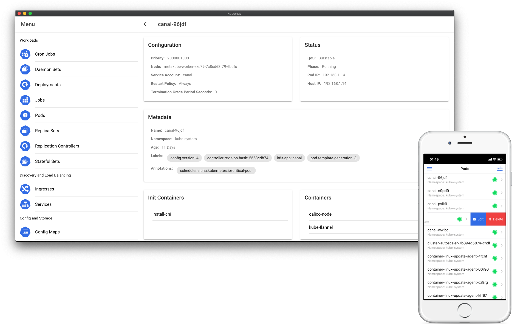

<div align="center">
  
  <br><br>

  **kubenav** is the navigator for your **Kubernetes** clusters right in your pocket. kubenav is a **mobile and desktop** app to help you manage Kubernetes clusters and stay up to date on whats going on in your clusters.

  <p>
    <a href="https://apps.apple.com/us/app/kubenav/id1494512160" target="_blank"></a>
    <a href="https://play.google.com/store/apps/details?id=io.kubenav.kubenav" target="_blank"></a>
    <a href="https://github.com/kubenav/kubenav/releases" target="_self"></a>
  </p>

  
</div>

kubenav is a mobile and desktop app to help you manage Kubernetes clusters. The app provides an overview of all your workloads and resources running in your clusters, including the current status. The details view of your workloads contains all the necessary logs and events to debug your clusters in case of problems. You can also edit and delete resources within the app.

The app is developed using [Ionic Framework](https://ionicframework.com) and [Capacitor](https://capacitor.ionicframework.com). The most parts of the app are implemented using React functional component and TypeScript. So we can achieve nearly 100% code sharing between the mobile and desktop implementation.

## Features

- [x] **Available for mobile and desktop**: kubenav is available for mobile and desktop with nearly 100% code sharing.
- [x] **Manage Workloads**: Manage workloads like Deployments, Pods and StatefulSets in your Kubernetes cluster.
- [x] **View your resources**: Get an overview of other resources like Services, ConfigMaps, Persistent Volumes, Secrets and Role Bindings.
- [x] **CRD support**: Out of the box support for Custom Resource Definitions.
- [x] **Filter**: Filter the resource overview by the selected Namespace.
- [x] **Debugging**: Automatic detection of problems with your Workloads. Get all corresponding events and logs.
- [x] **Edit YAML files**: Edit and save your YAML files right from the app.
- [x] **Delete resources**: Delete resources which are not needed anymore.
- [x] **Resource usage**: Get the resource usage of your nodes, pods and containers.
- [x] **Manage multiple clusters**: Add multiple clusters via `kubeconfig` or manually.

## Development

kubenav requires [Node v8.6.0](https://nodejs.org/) or later, and NPM version 5.6.0 or later (which is usually automatically installed with the required version of Node). If you have Node and NPM installedm, install Ionic CLI:

```sh
npm install -g ionic
```

Clone the repository, login to GitHub packages and install the required dependencies:

```sh
git clone git@github.com:kubenav/kubenav.git
cd kubenav

npm login --registry=https://npm.pkg.github.com
npm install
```

To use kubenav in you browser you need to start the development server. The server listening on port `14122`:

```sh
npm run server
```

Now you can start the app and open [localhost:8100](http://localhost:8100) in your browser:

```sh
ionic serve
```

You must build the kubenav project at least once before running on any native platform:

```sh
ionic build
```

Every time you perform a build (e.g. `ionic build`) that changes your web directory (default: `build`), you'll need to copy those changes down to your native projects:

```sh
npx cap sync
```

The native iOS and Android projects are opened in their standard IDEs (Xcode and Android Studio, respectively). Use the IDEs to run kubenav:

```sh
npx cap open ios
npx cap open android
npx cap open electron
```

You can also run the native iOS or Android app with live reloading:

```sh
ionic capacitor run android -l --address=0.0.0.0
ionic capacitor run ios -l --address=0.0.0.0
```

## Nightly Builds

For testing new features and faster feedback, we are running nightly builds for the `master` branch via GitHub Action. The builds are release in the [`gs://kubenav` Google Storage bucket](https://console.cloud.google.com/storage/browser/kubenav/). The following files are available for each day:

```
https://storage.googleapis.com/kubenav/<YYYY>-<MM>-<DD>/kubenav-<TAG>-darwin-amd64.dmg
https://storage.googleapis.com/kubenav/<YYYY>-<MM>-<DD>/kubenav-<TAG>-darwin-amd64.dmg.blockmap
https://storage.googleapis.com/kubenav/<YYYY>-<MM>-<DD>/kubenav-<TAG>-darwin-amd64.tar.gz
https://storage.googleapis.com/kubenav/<YYYY>-<MM>-<DD>/kubenav-<TAG>-linux-amd64.AppImage
https://storage.googleapis.com/kubenav/<YYYY>-<MM>-<DD>/kubenav-<TAG>-linux-amd64.tar.gz
https://storage.googleapis.com/kubenav/<YYYY>-<MM>-<DD>/kubenav-<TAG>-win32-amd64.exe
https://storage.googleapis.com/kubenav/<YYYY>-<MM>-<DD>/kubenav-<TAG>-win32-amd64.exe.blockmap
https://storage.googleapis.com/kubenav/<YYYY>-<MM>-<DD>/kubenav-<TAG>-win32-amd64.tar.gz
```

## Release

Every new release is created from the `master` branch. To create a new release the `version` field in the `package.json` file must be updated and a new tag must be set. This process is automated via `Makefile`:

```sh
make release-patch
make release-minor
make release-major
```

When the tag is pushed the changelog will be generated via GitHub Action and saved to the [CHANGELOG.md](./CHANGELOG.md) file. When the changelog was generated a new GitHub release can be created with the following naming scheme and the changelog for the current tag as description:

```
Version <TAG> (yyyy-mm-dd)
```

After the the release was created another GitHub Action is executed to create the Electron app for macOS, Linux and Windows via [electron-builder](https://www.electron.build). These files are added to the corresponding release. The following formats are available:

- `kubenav-<TAG>-linux.AppImage`: AppImage
- `kubenav-<TAG>-linux.tar.gz`: Archive containing the kubenav app for Linux
- `kubenav-<TAG>-mac.dmg`: Apple Disk Image
- `kubenav-<TAG>-mac.tar.gz`: Archive containing the kubenav app file for macOS
- `kubenav-<TAG>-win.exe`: NSIS installer
- `kubenav-<TAG>-win.tar.gz`: Archive containing the kubenav app for Windows

The native iOS and Android app is built manually and submitted to the App Store and Google Play. To prepare the app run the following commands:

```sh
export REACT_APP_VERSION=

ionic build

npx cap sync

npx cap open ios
npx cap open android
```

In the standard IDE for iOS and Android run a clean build and follow the steps to publish the app.
